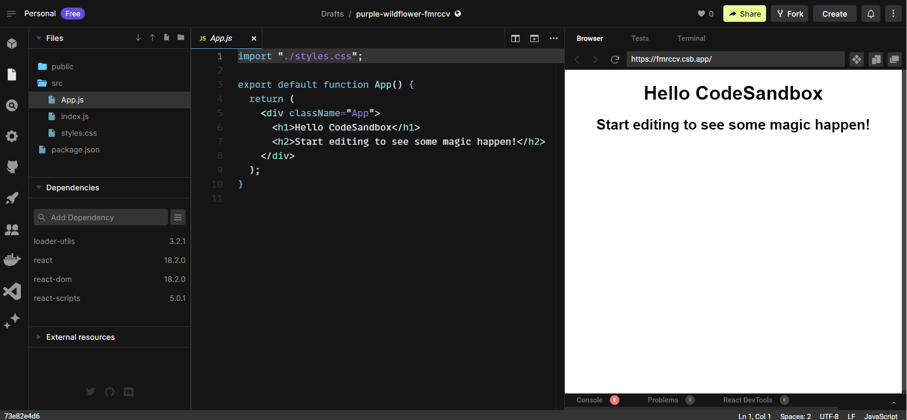

# Introduction to React and JSX

This chapter provides an overview of React, its core principles, and its popularity in the web development community.

## 1. What is React

React is a JavaScript library developed by Facebook that allows developers to build user interfaces using reusable components. It follows a component-based architecture where each component encapsulates its own logic and state. The main benefit of building component-based frontends is enhanced maintabilitiy. Change localization and sepeartion of concerns extended to javascript/html/css based frontend.

Components in React act as performers responsible for rendering specific parts of the user interface. React efficiently manages the rendering and updating of components, ensuring smooth performance of web applications.

For example, consider a React component responsible for rendering a comment section on a social media post. This component can be reused across multiple posts, encapsulating its own logic and rendering the comment content. With React's component-centric approach, this comment component can be easily composed and integrated with other components, creating a seamless and interactive user experience.

A reason for React’s popularity is that it is simple. This is because it focuses on doing one thing very well – providing a powerful mechanism for building UI components. Components are pieces of the UI that can be composed together to create a frontend. 

TypeScript is also a popular, mature library maintained by another big company, Microsoft. It allows users to add a rich type system to their JavaScript code, helping them be more productive, particularly in large code bases.

**Reference Material:**
- React Official Website: [https://reactjs.org/](https://reactjs.org/)
- React Documentation: [https://reactjs.org/docs/getting-started.html](https://reactjs.org/docs/getting-started.html)
- TypeScript Official Website: [https://www.typescriptlang.org/](https://www.typescriptlang.org/)


## 2. Setting up React

Setting up React involves creating an environment where developers can bring their React projects to life. Developers need to install Node.js, a powerful runtime environment that enables executing JavaScript code outside of a web browser.

Once Node.js is installed, developers can utilize package managers like npm (Node Package Manager) or Yarn to acquire and manage React-specific packages, tools, and dependencies. These package managers provide a collection of pre-built React packages and libraries that can be easily integrated into projects.

By leveraging npm or Yarn, developers can acquire the necessary tools and dependencies to build React projects. It's similar to selecting the perfect paint colors, brushes, and textures for an artist's palette, enabling developers to bring their artistic vision to reality.

**Reference Material:**
- Node.js Official Website: [https://nodejs.org/](https://nodejs.org/)
- npm Official Website: [https://www.npmjs.com/](https://www.npmjs.com/)
- Yarn Official Website: [https://yarnpkg.com/](https://yarnpkg.com/)


## 3. JSX

JSX (JavaScript XML) serves as a syntax extension for JavaScript, allowing developers to write HTML-like code directly within their JavaScript codebase. It acts as a bridge that connects JavaScript and HTML, enabling them to coexist harmoniously within the React ecosystem.

JSX is the syntax we use in a React component to define what the component should display.

When developers write JSX, it resembles HTML markup, but during the build process, it is transformed into regular JavaScript. This transformation converts JSX into a series of JavaScript function calls, creating a virtual representation of UI components.

Here's an example of JSX code:

```jsx
const element = <h1>Hello, World!</h1>;
```

The above JSX expression `<h1>Hello, World!</h1>` is transformed into the following JavaScript code:

```javascript
const element = React.createElement("h1", null, "Hello, World!");
```

Another jsx example

```jsx
function App() {
  return (
    <div className="App">
      <Alert type="information" heading="Success">
        Everything is really good!
      </Alert>
    </div>
  );
}
```
Notice the mix of JavaScript and html tags, also notice html tags that are not standard html such as ```<Alert>``` or attraibutes such as ```className``` this is what we call jsx or JavaScript syntax extension. This means that it doesn’t execute directly in the browser – it needs to be transpiled to JavaScript first. A popular tool that can transpile JSX is called Babel.

One tool we will use to explore jsx is Babel REPL which can be found at  https://babeljs.io/repl. Try copying and pasting the following jsx into the left-hand pane and notice the transpiled javascript genereted in the right-hand pane.

```jsx
const title = "Oh no!";
<div className="title">
  <span>{title}</span>
</div>
```

Try also this ternary JavaScipt expression:

```jsx
const title = "Oh no!";
<div className="title">
  <span>{title ? title : "Something important"}</span>
</div>
```


**Reference Material:**

- React Official Website: [https://reactjs.org/](https://reactjs.org/)
- JSX in Depth: [https://reactjs.org/docs/jsx-in-depth.html](https://reactjs.org/docs/jsx-in-depth.html)

JSX integrates HTML-like markup seamlessly into the React component structure, resulting in visually appealing and interactive user interfaces.


## 4. Virtual DOM

The Virtual DOM in React is a virtual representation of the actual browser DOM, acting as an intermediary between React and the browser. It resembles an architect's blueprint for a building, allowing React to efficiently manage and update the user interface.

The Virtual DOM can be seen as a lightweight copy of the real DOM, maintaining the desired structure and content of the user interface. By minimizing direct manipulation of the real DOM, React optimizes performance and rendering efficiency.

One of the primary benefits of using the Virtual DOM is performance optimization. When changes occur in a React component, React compares the previous Virtual DOM with the new one, identifying the differences or "diffs." Instead of updating the entire DOM, React selectively applies only the necessary changes to the actual DOM, resulting in faster and more efficient rendering.

Here's a simplified example to illustrate the process:

1. Suppose you have a React component that displays a list of items, and one item is modified.
2. React creates a new Virtual DOM representation of the component, including the updated item.
3. React then compares the new Virtual DOM with the previous one to identify the specific change.
4. React generates a minimal set of DOM operations needed to update the actual browser DOM, targeting only the modified item.
5. Finally, React applies these targeted changes to the real DOM, resulting in an updated user interface.

By utilizing the Virtual DOM and performing selective updates, React minimizes the performance impact, even in complex applications with numerous components.

**Reference Material:**

- React Virtual DOM: [https://reactjs.org/docs/faq-internals.html#what-is-the-virtual-dom](https://reactjs.org/docs/faq-internals.html#what-is-the-virtual-dom)

## 5. React Components

We will introduce React Components in the following section in this chapter. React Components are the main building block for React application and therefore we will continue elaborating on them in the following chapters.

To quickly experiment with creating React Components we will use the online tool CodeSandbox. This can be found at [https://codesandbox.io/](https://codesandbox.io/).

React components are the building blocks of a React application, representing reusable and self-contained units of functionality and user interface. They can be compared to individual pieces of a jigsaw puzzle that come together to form a complete picture.

Later we will disucss createing React project on local computer but for now, let’s carry out the following steps to create a React component in CodeSandbox:

1. Go to [https://codesandbox.io/](https://codesandbox.io/) in a browser and click the Create Sandbox button found on the right hand side of the page.
2. A list of project templates appears. Click the React template (don’t choose the React TypeScript template because we are focusing solely on React in this chapter).

In a few seconds, a React project will be created:



There are three main panels in the CodeSandbox editor:

- The Files panel: This is usually on the left-hand side and contains all the files in the project.
- The Code editor panel: This is usually the middle panel, and it contains the code. This is where we will write our React component code. Clicking a file in the Files panel will open it in the code editor panel.
- The Browser panel: This displays a preview of the running app and is usually on the right-hand side.

**Understanding the React entry point**

The entry point of this React app is in the ```index.js``` file. Open this file by clicking on it in the Files panel and inspect its contents:

```JavaScript
import { StrictMode } from 'react';
import { createRoot } from 'react-dom/client';
import App from './App';
const rootElement = document.getElementById('root');
const root = createRoot(rootElement);
root.render(
  <StrictMode>
    <App />
  </StrictMode>
);
```

Let's break down the code step by step:

1. Importing React-related dependencies:

```JavaScript
import { StrictMode } from 'react';
import { createRoot } from 'react-dom/client';
```

In this section, we import the ```StrictMode``` component from the react package and the ```createRoot``` function from the ```react-dom/client``` package. ```StrictMode``` is a development mode feature that performs additional checks and warnings to help identify potential issues in your code.

2. Importing the App component:

```JavaScript
import App from './App';
```
Here, we import the App component from a file named App.js or App.jsx located in the same directory as the index.js file. This assumes that you have an App component defined in that file.

3. Retrieving the root element from the HTML document:

```JavaScript
const rootElement = document.getElementById('root');
```
The code uses the ```getElementById``` method to retrieve the DOM element with the ID of 'root'. This element serves as the mounting point for the React application. You would typically have an HTML file with an element like ```<div id="root"></div>``` where your React application will be rendered.

4. Creating the root and rendering the app:
```JavaScript
const root = createRoot(rootElement);
root.render(
  <StrictMode>
    <App />
  </StrictMode>
);
```

Now, the React’s ```createRoot``` function takes in a DOM element and returns a variable that can be used to display a React component tree. The ```rootElement``` variable is then passed into ```createRoot```, and the result is assigned to a ```root``` variable.
The ```render``` function is called on the ```root``` variable, passing in JSX containing the ```StrictMode``` component with the ```App``` component nested inside. The ```render``` function displays the React components on the page. This process is often referred to as ***rendering***.

The ```StrictMode``` component will check the content inside it for potential problems and report them in the browser’s console. This is often referred to as React’s strict mode. The strict mode in React is different from the strict mode in JavaScript, but their purpose of eliminating bad code is the same.

**Two Types of Components**

There are two types of components in React: functional components and class components.

1. Functional Components: Functional components are JavaScript functions that receive input data called props and return React elements to render the user interface. They are simple, stateless, and efficient. Here's an example of a functional component:

```jsx
function Greeting(props) {
  return <h1>Hello, {props.name}!</h1>;
}
```

2. Class Components: Class components are ES6 classes that extend the React.Component class, inheriting useful React features. They have additional capabilities such as managing state and lifecycle methods. Here's an example of a class component:

```jsx
class Counter extends React.Component {
  constructor(props) {
    super(props);
    this.state = { count: 0 };
  }

  render() {
    return <h1>Count: {this.state.count}</h1>;
  }
}
```

To create and render components, developers include them within the desired context of their application. Components can be nested inside each other, forming a hierarchy resembling a tree of interconnected puzzle pieces. By passing props and managing state, components work together to form a cohesive and interactive user interface.

For example, let's assume we have the following ```App``` component that renders both the ````Greeting``` and ```Counter``` components:

```jsx
function App() {
  return (
    <div>
      <Greeting name="John" />
      <Counter />
    </div>
  );
}
```

In this example, the ```App``` component serves as the root of our React application, containing the Greeting and Counter components as its children. When the application is rendered, the components come together, and their output forms the complete picture of the user interface.

By understanding the concept of components and the differentiation between functional and class components, developers can leverage modularity and reusability to build robust and scalable React applications.

Reference Material:

- React Components: [https://reactjs.org/docs/components-and-props.html](https://reactjs.org/docs/components-and-props.html)


