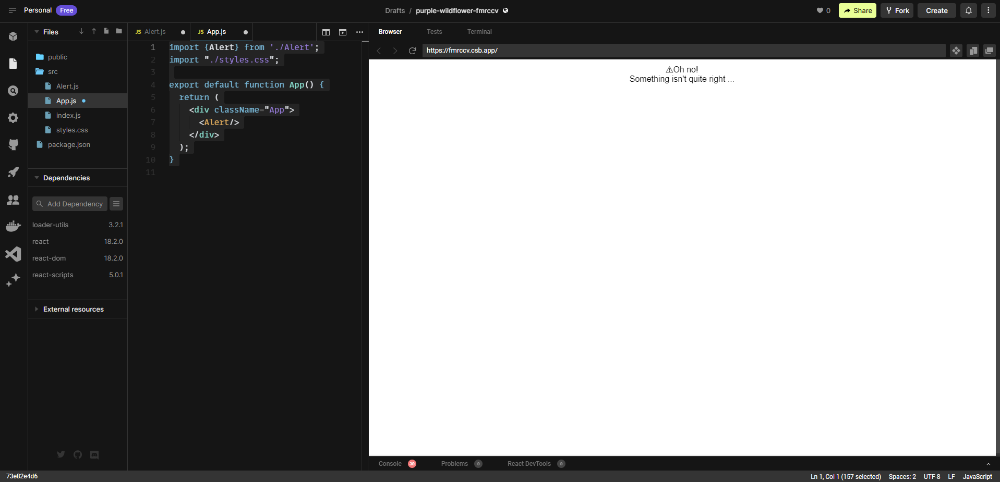

# React Components and Components Lifecycle

## 1. Introduction to React Components

React components are the fundamental building blocks of a web application. They provide specific functionality and user interface, similar to individual elements in a structure. Components in React represent different parts of the user interface, such as buttons, forms, or navigation bars. They encapsulate logic, styling, and behavior, making them modular and reusable.

React components are designed to work together harmoniously, forming a hierarchical structure. Data and information flow seamlessly between components, enabling the application to function as a cohesive whole. Here's an example of a basic functional component in React:

```jsx
function Greeting(props) {
  return <h1>Hello, {props.name}!</h1>;
}
```

**Notice** We have touched on Class Components in Chapter 1, but it seems that the community are leaning towards functional components in modern React applications, and we will follow that as well for here on in this course.

In this example, the `Greeting` component renders a personalized greeting based on the `name` prop it receives. This component can be reused multiple times with different names, similar to various elements serving different purposes but following a similar blueprint.

## 2. Creating a Basic Alert Component

Now, we are going to create a component that displays an alert, which we will simply call `Alert`. It will consist of an icon, a heading, and a message.

***Notice*** that a React component must start with a capital letter.

Carry out the following steps to create the component in the CodeSandbox project:

1. We will continue using `codesandbox.io`. In the Files panel, right-click on the src folder and choose Create File in the menu that appears.
2. The cursor is placed in a new file, ready for you to enter the component filename. Enter `alert.js` as the filename and press Enter.

**Notice** that the filename for component files isn’t important to React or the React transpiler. It is common practice to use the same name as the component, either in Pascal or snake case. In this course we will adapat snake case. However, the file extension must be `.js` or `.jsx` for React transpilers to recognize these as React components.

3. The `alert.js` file automatically opens in the code editor panel. Enter the following code into this file:
```JavaScript
function Alert() {
  return (
    <div>
      <div>
        <span role="img" aria-label="Warning">⚠</span>
        <span>Oh no!</span>
      </div>
      <div>Something isn't quite right ...</div>
    </div>
  );
}
```
**Understanding the importance of modules**
By default, JavaScript code executes in what is called the global scope. This means code from one file is automatically available in another file. 

Unfortunately, this means that the functions we implement can overwrite functions in other files if the names are the same. You can imagine how this structure quickly becomes challenging and risky to maintain.

Thankfully, JavaScript has a modules feature. A module’s functions and variables are isolated, so functions with the same name in different modules won’t collide. This is a much safer way to structure code and is common practice when structuring React apps.

A module is simply a file with at least one export statement. Members not contained within the export statement are private and not available outside the module.

Consider a file named `mathUtils.js` that contains mathematical utility functions:

```JavaScript
// mathUtils.js
export function add(a, b) {
  return a + b;
}
export function subtract(a, b) {
  return a - b;
}
export const PI = 3.14159;
```

In this module, we have two functions (`add` and `subtract`) and a constant (`PI`) defined using the export keyword. These entities are exposed and can be used by other modules.

Now, let's create another file named `app.js` that uses the functions and constant from the `mathUtils.js` module:

```JavaScript
// app.js
import { add, subtract, PI } from './mathUtils.js';

console.log(add(5, 3)); // Output: 8
console.log(subtract(10, 4)); // Output: 6
console.log(PI); // Output: 3.14159
```

In this file, we import the `add`, `subtract`, and `PI` entities using the `import` statement. We specify the file path `(./mathUtils.js)` to locate the module.


Next, we will go back and modualrize the `Alert` and add it to the `App` we are building in `codesandbox.io`

1. First, we need to export the `Alert` component. Open `alert.js` and add the export keyword before the `Alert` function:

```JavaScript
export function Alert() {
  return (
    <div>
      <div>
        <span role="img" aria-label="Warning">⚠</span>
        <span>Oh no!</span>
      </div>
      <div>Something isn't quite right ...</div>
    </div>
  );
}
```
***Notice*** that it is recommended to have earch React component in a separate file. This helps the readability of the code and prevents the files from becoming too large.

2. Now we import `Alert` into `app.js`:

```JavaScript
import {Alert} from './alert';
import "./styles.css";

export default function App() {
  return (
    <div className="App">
      <h1>Hello CodeSandbox</h1>
      <h2>Start editing to see some magic happen!</h2>
    </div>
  );
}
```
3. We can now reference `Alert` in the `App` component's JSX:

```JavaScript
import {Alert} from './alert';
import "./styles.css";

export default function App() {
  return (
    <div className="App">
      <Alert/>
    </div>
  );
}
```
The component will display the following in the Browser panel:


Now let's discuss Compnenets `state` and properties, which the React community conventially refers to them as `props`.

## 4. Component State and Props

In React components, `state` and `props` play crucial roles in providing data and enabling dynamic behavior. 

Props which is parameters to React components brings specific information and instructions to a component. They are passed from parent components to child components, allowing data to flow down the component tree. Props are read-only and cannot be modified by the receiving component.

State, on the other hand, represents the internal data of a component that can change over time. It's like the fuel that powers a component's internal workings. State is managed within the component itself and can be updated using special methods provided by React.

**Using Props**

Here's first an example showcasing the use of props:

1. Open `alert.js` and add a props parameter to the function:

```JavaScript
export function Alert(props) {
  ...
}
```
2. We will define the following properties for the alert:
- type: This will either be "information" or "warning" and will determine the icon in the alert.
- heading: This will determine the heading of the alert.
- children: This will determine the content of the alert. The children prop is actually a special prop used for the main content of components.

Update the alert component’s JSX to use the props as follows:

```JavaScript
export function Alert(props) {
  return (
    <div>
      <div>
        <span
          role="img"
          aria-label={
            props.type === "warning"
              ? "Warning"
              : "Information"
          }
        >
          {props.type === "warning" ? "⚠" : "ℹ"}
        </span>
        <span>{props.heading}</span>
      </div>
      <div>{props.children}</div>
    </div>
  );
}
```
3. Now we will pass `props` from the parent `App` component to child `Alert`:
```JavaScript
export default function App() {
  return (
    <div className="App">
      <Alert type="information" heading="Success">
        Everything is really good!
      </Alert>
    </div>
  );
}
```
The Browser panel now displays the configured alert component:


Alternatively, we can decompose the `props` parameter to `Alert` as the following:

```JavaScript
export function Alert({ type, heading, children }) {
  return (
    <div>
      <div>
        <span
          role="img"
          aria-label={
            type === "warning" ? "Warning" :               "Information"
          }
        >
          {type === "warning" ? "⚠" : "ℹ"}
        </span>
        <span>{heading}</span>
      </div>
      <div>{children}</div>
    </div>
  );
```

Furthermore we can default the `props` parameters values, for example:

```JavaScript
export function Alert({type = "information",heading,children}) {
  ...
}
```

**Using State**
The component state is a special variable containing information about the component’s current situation. For example, a component may be in a loading state or an error state.

When a user interacts with a component, the component’s output may need to change. For example, clicking on a component may need to make an element in the component invisible. A change to a component state causes the component to refresh, more often referred to as re-rendering. So, a user could click on a component causing a state change, resulting in an element in the component becoming invisible.

State is defined using a useState function from React. The useState function is one of React’s hooks. React hooks were introduced to React in version 16.8 and give function components powerful capabilities such as state. 

The syntax for useState is as follows:

```JavaScript
const [state, setState] = useState(initialState);
```

The initial state value is passed into useState. If no value is passed, it will initially be undefined.
- useState returns a tuple containing the current state value and a function to update the state value. The tuple is destructured in the preceding code snippet.
- The state variable name is state in the preceding code snippet, but we can choose any meaningful name.
- We can also choose the state setter function name, but it is common practice to use the same name as the state variable preceded by set.
- Multiple states can be defined by defining multiple instances of useState. For example, here are definitions for loading and error states:

```JavaScript
const [loading, setLoading] = useState(true);
const [error, setError] = useState();
```

**Reference Material:**

- React Props: [React Props](https://reactjs.org/docs/components-and-props.html#props-are-read-only)
- React State and Lifecycle: [React State and Lifecycle](https://reactjs.org/docs/state-and-lifecycle.html)

Understanding how to utilize props and state is vital for building dynamic and interactive React applications. Props allow components to receive and display data, while state enables components to manage their internal state and respond to user interactions. 

