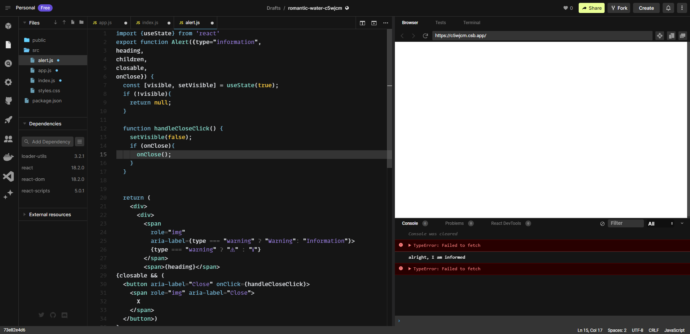

# More on Sate in React and Events

In this chapter we will continue discussing `state` in React. We will start by implementing visible state in the `Alert` component we built in chapter 2.

The visible state will allow the user to close the `Alert` component. Follow these steps:
1. In `alert.js` add 
```JavaScript
import { useState } from 'react';
```
2. Define the `visible` state as follows:
```JavaScript
export funtion Alert(...){
  const [visible, setVisible] = useState(true)
  if (!visible){
    return null;
  }
  return(
    ...
  );
}
```
3. Add a close button to the `Alert` component so that the component becomes as the following:
```JavaScript
import {useState} from 'react'
export function Alert({type="information", 
heading, 
children, 
closable}) {
  const [visible, setVisible] = useState(true);
  if (!visible){
    return null;
  }
  return (
    <div>
      <div>
        <span
          role="img"
          aria-label={type === "warning" ? "Warning": "Information"}>
          {type === "warning" ? "⚠" : "ℹ"}
        </span>
        <span>{heading}</span>
        <button aria-label="Close">
          <span role="img" aria-label="Close">X</span>
        </button>
      </div>
      <div>{children}</div>
    </div>
  );
}
```
4. We would like to render the close button only if `closable` property is `true`, we can do that with a trick using `&&`. We logically And Closable to the button tag which means that if `closable` is not true it will shortcircuit and won't render the button. The following is the code snipet:
```JavaScript
...
{closable && (
        <button aria-label="Close">
          <span role="img" aria-label="Close">
            X
          </span>
        </button>)
}
...
```
5. Now we pass `closable` to the `Alert` from `App` component.

```JavaScript
export default function App() {
  return (
    <div className="App">
      <Alert type="information" heading="Success"  closable>
        Everything is really good!
      </Alert>
    </div>
  );
}
```
***Notice*** that we don't need to state closable={true} since true here is assumed by default.

6. We will now add evnet handling so that the close button actually closes the Alert, first add handler to the JSX in the `Alert` component:
```JavaScript
<button aria-label="Close" onClick={handleCloseClick}>
```
and now add the function `handleCloseClick` inside `Alert` main function so now the complete `alert.js` would look like:
```JavaScript
import {useState} from 'react'
export function Alert({type="information", 
heading, 
children, 
closable}) {
  const [visible, setVisible] = useState(true);
  if (!visible){
    return null;
  }

  function handleCloseClick() {
    setVisible(false);
  }

  return (
    <div>
      <div>
        <span
          role="img"
          aria-label={type === "warning" ? "Warning": "Information"}>
          {type === "warning" ? "⚠" : "ℹ"}
        </span>
        <span>{heading}</span>
{closable && (
  <button aria-label="Close" onClick={handleCloseClick}>
    <span role="img" aria-label="Close">
      X
    </span>
  </button>)
}
</div>
      <div>{children}</div>
    </div>
  );
}
```
7. A final step is to notify other components that `Alert` has closed so they might do something. We do that in React by raising an event. First we add `onClose` to  `props` of `Alert`:
```JavaScript
export function Alert({
  type = "information",
  heading,
  children,
  closable,
  onClose
}) {
  ...
}
```
and then in the event handler ```onCloseClick()``` we call ```onClose``` as:
```JavaScript
function handleCloseClick() {
  setVisible(false);
  if (onClose) {
    onClose();
  }
}
```
Now in `App` component we can pass in a function to `onClose` attribute of `Alert` to be called so that the complete `app.js` becomes as:

```JavaScript
import {Alert} from './alert'
import "./styles.css";

export default function App() {
  function informMe(){
    console.log("alright, I am informed");
  }
  return (
    <div className="App">
    <Alert type="information" heading="Success"  closable onClose={informMe}>
    Everything is really good!
    </Alert>
      </div>
  );
}
```
Now clicking the `X` button will not only close the `Alert` component but will inform parent `App` as well.


**Reference Material:**

- Handling Events: [Handling Events - React Documentation](https://reactjs.org/docs/handling-events.html)


# Component Lifecycle

In React components, lifecycle methods provide hooks into different stages of a component's existence. They enable developers to perform actions at specific points in a component's lifecycle, such as initialization, rendering, and destruction.

Here are a few commonly used lifecycle methods in React:

- `componentDidMount()`: This method is called immediately after the component is mounted (i.e., inserted into the DOM). It's often used for initial setup, such as fetching data from an API.

- `componentDidUpdate()`: This method is called after a component is updated

 (i.e., after props or state changes). It can be used to perform additional logic or side effects based on the changes.

- `componentWillUnmount()`: This method is called right before a component is unmounted (i.e., removed from the DOM). It allows for cleanup tasks, such as removing event listeners or canceling subscriptions.

Here's an example showcasing the usage of these lifecycle methods:

```jsx
class Timer extends React.Component {
  constructor(props) {
    super(props);
    this.state = { seconds: 0 };
  }

  componentDidMount() {
    this.timerID = setInterval(() => this.tick(), 1000);
  }

  componentDidUpdate() {
    if (this.state.seconds >= 60) {
      clearInterval(this.timerID);
    }
  }

  componentWillUnmount() {
    clearInterval(this.timerID);
  }

  tick() {
    this.setState((prevState) => ({ seconds: prevState.seconds + 1 }));
  }

  render() {
    return <div>Seconds: {this.state.seconds}</div>;
  }
}
```

In this example, the `Timer` component uses the `componentDidMount()` method to start a timer when the component is mounted. The `componentDidUpdate()` method is used to stop the timer if the seconds reach or exceed 60. Finally, the `componentWillUnmount()` method is used to clean up the timer before the component is unmounted.

**Reference Material:**

- React Component Lifecycle: [React Component Lifecycle](https://reactjs.org/docs/react-component.html#the-component-lifecycle)
- React 16.3 Lifecycles: [React 16.3 Lifecycles](https://reactjs.org/blog/2018/03/27/update-on-async-rendering.html#updating-lifecycle-methods)

Understanding and utilizing lifecycle methods in React allows developers to control and manage the behavior of components throughout their lifecycle. By tapping into these methods, developers can initialize, update, and clean up resources as needed, ensuring smooth and efficient component interactions.
