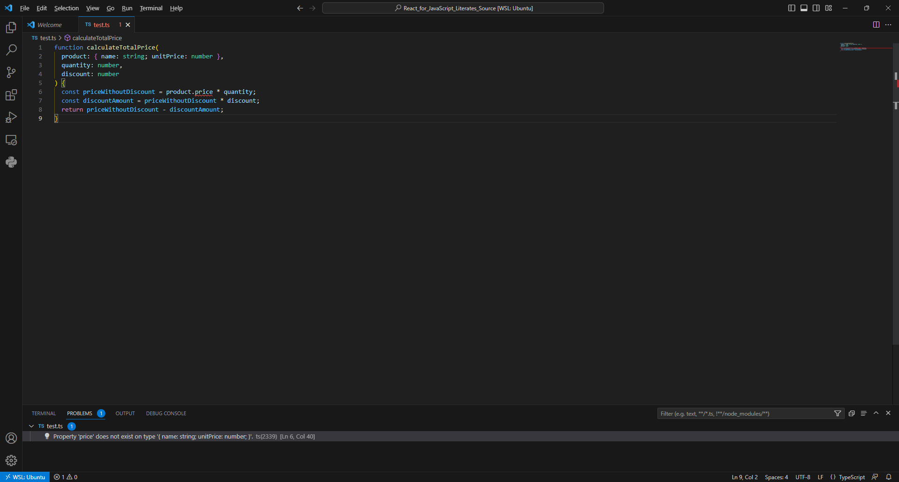
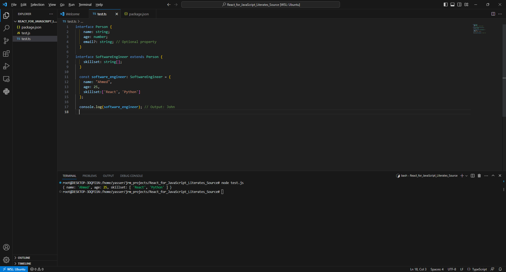

# Crash Course in Type Script

Before we continue with React, let's equipe ourselves with some basic but adequate understading of TypeScript, the scripting language we will be using to write React applications.

***Notice*** that so far we were using `codesandbox.io`, but from now on we will use [Visual Studio Code](https://code.visualstudio.com/) to experiment and try code samples. You have to have node.js and npm installed as well. You can install both of them from [here](https://nodejs.org/en/download/). Two more steps to be able to build and run TypeScript
1. From terminal run `apt install node-typescript`
2. Add package.json to the root of your code folder and paste the following:
```JavaScript
{
  "name": "my-app",
  "description": "This is me experimenting with TypeScript",
  "version": "0.0.1",
  "devDependencies": {
    "typescript": "^4.6.4"
  }
}
```
3. Now if your code is `test.ts` file you can build and run it from the terminal using the following commands:
`npm run build`
`node test.js`


## TypeScript Basics

TypeScript is a programming language that was first released in 2012 and is still being updated regularly. It’s like an upgraded version of JavaScript, with extra features that make it easier to use. However, TypeScript code can’t be run directly in a web browser like JavaScript can. Instead, it has to be converted into JavaScript first.

TypeScript adds a rich type system to JavaScript. It is generally used with frontend frameworks such as Angular, Vue, and React.

TypeScript adds some extra features to JavaScript, like the ability to specify the types of variables, function parameters, and return values. This can help prevent bugs and make your code easier to read and understand.

For example, let's say you have a function that adds two numbers together. In JavaScript, you might write it like this:

```javascript
function add(a, b) {
  return a + b;
}
```

In TypeScript, you can specify the types of the `a` and `b` parameters to make sure they are both numbers:

```typescript
function add(a: number, b: number): number {
  return a + b;
}
```

This way, if you accidentally try to call the `add` function with something other than numbers, TypeScript will give you an error and prevent you from making a mistake.

Let's try copying the following code in test.ts file in Visual Studio Code

```TypeScript
function calculateTotalPrice(
  product: { name: string; unitPrice: number },
  quantity: number,
  discount: number
) {
  const priceWithoutDiscount = product.price * quantity;
  const discountAmount = priceWithoutDiscount * discount;
  return priceWithoutDiscount - discountAmount;
}
```
You will see that `price` is underlined in red in Visual Studio Code as it doesn't belong to `proudct` object. This wouldn't be caught by JavaScript until code is run but with TypeScript we can detect it early in the development.


## Basic Types in TypeScript

JavaScript only has a minimal set of types, such as string, number, and boolean. It is worth noting that all of the JavaScript types are available in TypeScript because Typescript is a superset of Javascript.

Also, JavaScript allows a variable to change its type – meaning that the JavaScript engine won’t throw an error if a variable is changed to a completely different type. This loose typing makes it impossible for code editors to catch type errors.

Types in TypeScript allow you to specify the type of data that a variable can hold. This can help prevent bugs and make your code easier to read and understand. Here are some common types in TypeScript and examples of how to use them:

- Boolean: This type represents a value that can be either true or false. For example:
```TypeScript
let isDone: boolean = false;
```

- Number: This type represents a numeric value. For example:
```TypeScript
let decimal: number = 6;
let hex: number = 0xf00d;
let binary: number = 0b1010;
let octal: number = 0o744;
```
- String: This type represents a sequence of characters. For example:
```TypeScript
let color: string = "blue";
color = 'red';
```

- Array: This type represents an ordered list of values. You can specify the type of the values in the array using square brackets [] or the Array type. For example:
```TypeScript
let list: number[] = [1, 2, 3];
let list: Array<number> = [1, 2, 3];
```

- Tuple: This type represents an array with a fixed number of elements, where each element can have a different type. For example:
```TypeScript
let x: [string, number];
x = ["hello", 10]; // OK
x = [10, "hello"]; // Error
```

- Enum: This type represents a set of named values. For example:
```TypeScript
enum Color {Red, Green, Blue}
let c: Color = Color.Green;
```

- Any: This type represents any value. It’s useful when you don’t know the type of a value or when you want to allow any type. For example:
```TypeScript
let notSure: any = 4;
notSure = "maybe a string instead";
notSure = false; // okay, definitely a boolean
```

In addition to the basic types I mentioned earlier, TypeScript also has some more advanced types that can be useful in certain situations. Here are a few examples:

- Union Type: This type allows you to specify that a variable can be one of several different types. For example:
```TypeScript
let myVar: string | number;
myVar = "hello"; // OK
myVar = 5; // OK
myVar = true; // Error
```

Intersection Type: This type allows you to combine multiple types into one. For example:
```TypeScript
interface A {
  a: string;
}
interface B {
  b: number;
}
let myVar: A & B = { a: "hello", b: 5 }; // OK
```

Type Aliases: This feature allows you to create a new name for an existing type. For example:
```TypeScript
type MyString = string;
let myVar: MyString = "hello"; // OK
```

Type Assertions: This feature allows you to tell TypeScript that you know the type of a value better than it does. For example:
```TypeScript
let myVar: any = "hello";
let strLength: number = (<string>myVar).length; // OK
```
## Creating Custom Types in TypeScript 

### Objects

Creating types is a fundamental aspect of TypeScript that allows us to define the shape and structure of our data. There are several ways to create types in TypeScript, including interfaces, type aliases, and literal types. In addition to JavaScript Objects that we can still use as well, here is first two examples of how to use JavaScript Objects:

```TypeScript
let mydaughter = {name:"Nada", grade:4};
```
Here types of `name` and `grade` attributes are infered, and we can explicitly define the strucutre of the object and then create instances using `let`:
```TypeScript
type Student = {name:string, grade:number};
let mydaughter:Student = {name:"Nada", grade:4}
```

### Intefaces

Now let's see how to define types using interfaces:
```TypeScript
interface Person {
  name: string;
  age: number;
  email?: string; // Optional property
}

const person: Person = {
  name: "John",
  age: 30,
};

console.log(person.name); // Output: John

```
Interfaces can be exteded as in:

```TypeScript
interface SoftwareEngineer extends Person {
  skillset: string[];
}

const software_engineer: SoftwareEngineer = {
  name: "Ahmed",
  age: 25,
  skillset:['React', 'Python']
};

console.log(software_engineer); // Output: John

```



### Classes

In TypeScript, classes provide a way to define blueprints for creating objects with specific properties and behaviors. Classes are an essential part of object-oriented programming (OOP) and allow you to encapsulate data and functionality into reusable units. Let's explore how to create classes in TypeScript with some examples:


```TypeScript
class Person {
  private name: string;
  private age: number;

  constructor(name: string, age: number) {
    this.name = name;
    this.age = age;
  }

  public greet(): void {
    console.log(`Hello, my name is ${this.name} and I'm ${this.age} years old.`);
  }
}

const person = new Person("John", 30);
person.greet(); // Output: Hello, my name is John and I'm 30 years old.

```
In this example, we create a class called Person that represents a person with a name and an age. The class has a private property name of type string and a private property age of type number. The constructor is used to initialize the name and age properties when creating an instance of the class.

The class also has a public method greet() that logs a greeting message to the console, including the name and age of the person.

To create an object based on the Person class, we use the new keyword followed by the class name and provide the required arguments to the constructor. In this case, we create a person object with the name "John" and the age 30. We can then call the greet() method on the person object to display the greeting.

Additionally, TypeScript allows you to specify access modifiers for class members. In the example above, the name and age properties are marked as private, which means they can only be accessed within the class. The greet() method is marked as public, making it accessible from outside the class.

Classes in TypeScript support inheritance, interfaces, static members, and more. They provide a powerful tool for organizing and structuring your code in an object-oriented manner.


