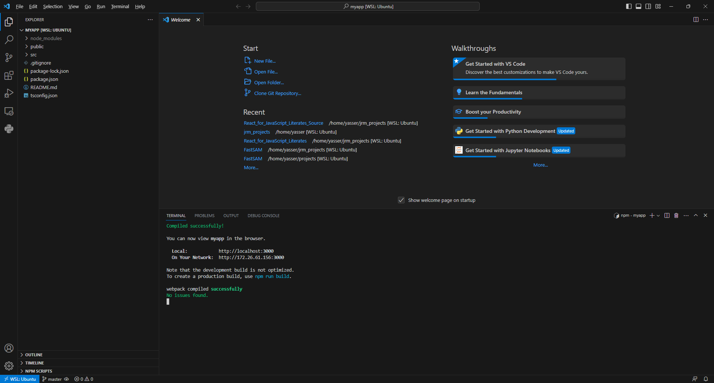
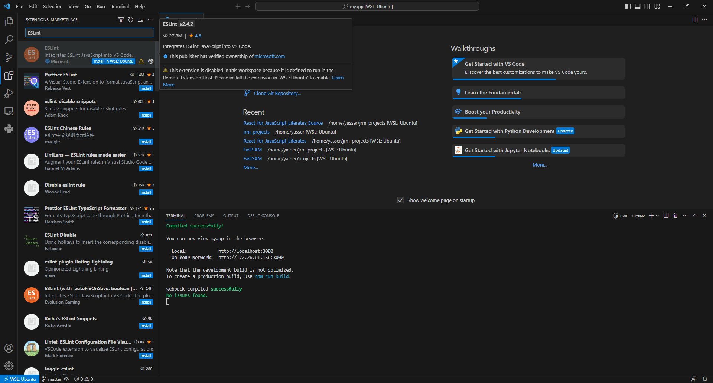
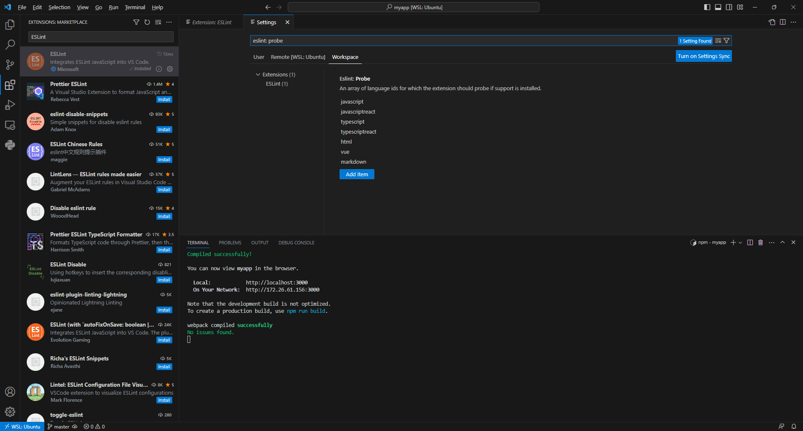
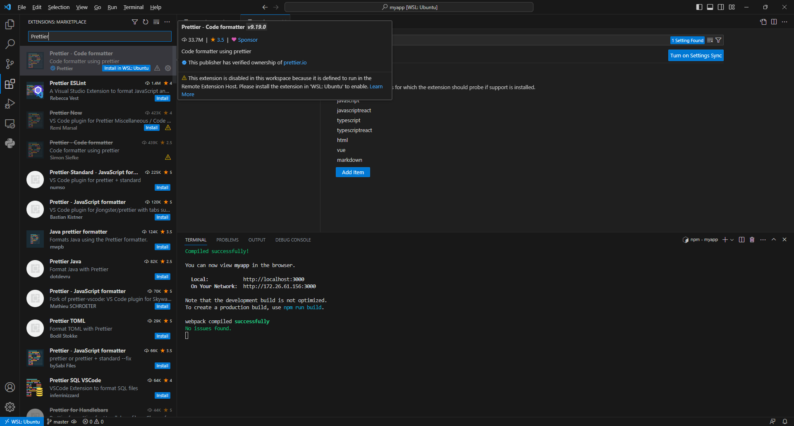
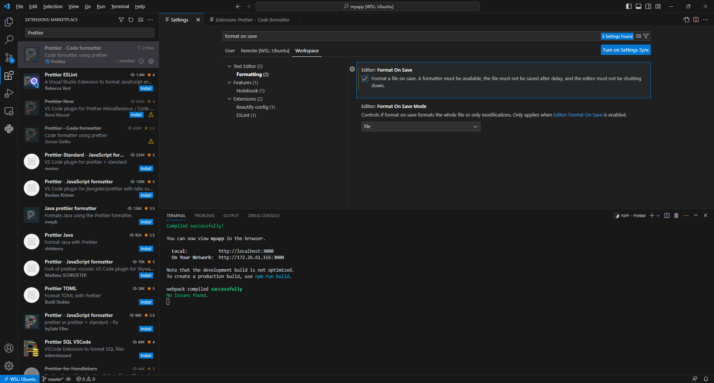
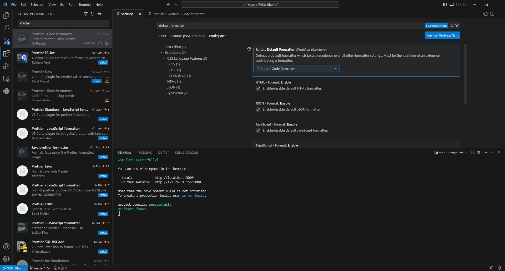
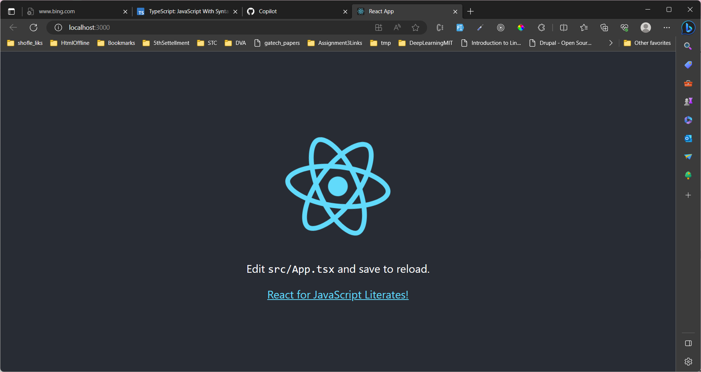

# React TypeScrirpt Scafolding and Tooling

We will continue using same tools from last chapter, `visual studio code`, `node`, and `npm` when we discussed TypeScript as a programming language. But in order to write a React application we will need to discuss how to bundle the different resources and transpile JSC and TypeScript to JavaScript along with the proper folder structure we need to use.

First let's disucss our build tool: webpack

## Webpack

Webpack is a popular module bundler used in React applications (and many other JavaScript applications) to package and bundle various assets, such as JavaScript files, CSS stylesheets, images, and more. Its primary role in React applications is to optimize and prepare the code for deployment by performing several tasks:

- Module Bundling: Webpack analyzes the dependency tree of your application and bundles all the required modules into a single or multiple output files. This reduces the number of HTTP requests made by the browser, improving the application's performance.

- Code Transformation: Webpack can transform code using loaders. Loaders enable you to preprocess different types of files before they are bundled. For example, webpack can use Babel as a loader to transpile modern JavaScript (ES6+) into older versions that are widely supported by browsers.

- Development Server: Webpack includes a built-in development server that allows you to run your React application locally during development. The development server automatically rebuilds and reloads the application whenever changes are made, making the development process more efficient.

- Asset Management: Webpack treats all assets in your application, such as images, fonts, and stylesheets, as modules. It can handle these assets by applying loaders to process and optimize them. For example, webpack can compress images or inline small images as data URLs to reduce network requests.

- Code Splitting: Webpack supports code splitting, which allows you to split your code into smaller chunks. This feature is especially useful for large applications, as it enables lazy loading of modules, reducing the initial load time of the application.

- Environment Configuration: Webpack provides a way to configure different environments, such as development, production, or testing. It allows you to specify environment-specific settings and optimizations, ensuring that your React application performs optimally in each environment.

## Scafolding React App

Open `Visual Studio Code` in the folder where you want the project to be. Run the following command:
``` Shell
npx create-react-app myapp --template typescript
```

`creat-react-app` is a otoo that creates React/TypeScript project, we pass the name of the project as `myapp` and we specified `typescript` as the template should be used.

```Shell
npm start
```



Couple of Visual Stuiod Extensions that would help us writing TypeScript effectivley:
1. ESLint for type checking, install and make sure that typescript and typescriptreact are included in the array of langug ids for which the extension should probe.



2. Prettier for code formatting, install and make sure Format On Save is selected in the workspace settings, and Prettier is selected as the default formatter




3. Look into `App.tsx`, change "Learn React" to "React for JavaScript Literates!" once the file is saved, the running app is automatically refreshed with the updated link text.


4. Stop the app using the shortcut key `Ctrl + C.`
5. Produce the build that can be deployed to production by running this command in the terminal:
```Shell
npm run build
```
`build` npm script is already created and configured by `create-react-app` for us in the `package.json` In a few seconds build folder will be created. Look into build folder and familirize youeself with its content. All the files are optimized for production with whitespace removed and the JavaScript minified.

6. Now we would like to add a component to the React app we just created. We will use the same `Alert` component we created in earlier chapters. 
First create `Alert.tsx` in the `src` folder and paste the following code which is the same code we created in earlier chapters with small modification:
```TypeScript
import React, {useState} from 'react'
type Props = {
    type?: string;
    heading: string;
    children: React.ReactNode;
    closable?: boolean;
    onClose?: () => void;
  };
  
export function Alert({
type="information", 
heading, 
children, 
closable,
onClose}:Props) {
  const [visible, setVisible] = useState(true);
  if (!visible){
    return null;
  }

  function handleCloseClick() {
    setVisible(false);
  }

  return (
    <div>
      <div>
        <span
          role="img"
          aria-label={type === "warning" ? "Warning": "Information"}>
          {type === "warning" ? "⚠" : "ℹ"}
        </span>
        <span>{heading}</span>
{closable && (
  <button aria-label="Close" onClick={handleCloseClick}>
    <span role="img" aria-label="Close">
      X
    </span>
  </button>)
}
</div>
      <div>{children}</div>
    </div>
  );
}

```
We add `type Props` and then used it to strongly type the input to the `Alert` component.
The App.tsx should also look like the following:
```TypeScript
import {Alert} from './Alert'
import "./App.css";


function App() {
  function informMe() {
    console.log("alright, I am informed");
  }

  return (
    <div className="App">
      <Alert 
      type="information" 
      heading="Success" 
      closable 
      onClose={informMe}>
        Everything is really good!
      </Alert>
    </div>
  );
}
export default App;
```
7. One final thing we can do in `Alert.tsx` we can strongly type the `visible` variable we initializ from `useState` as in the following line in 
```TypeScript
const [visible, setVisible] = useState<boolean>();
```
